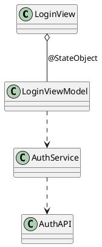
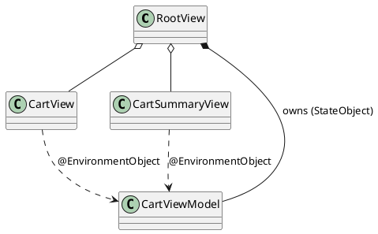
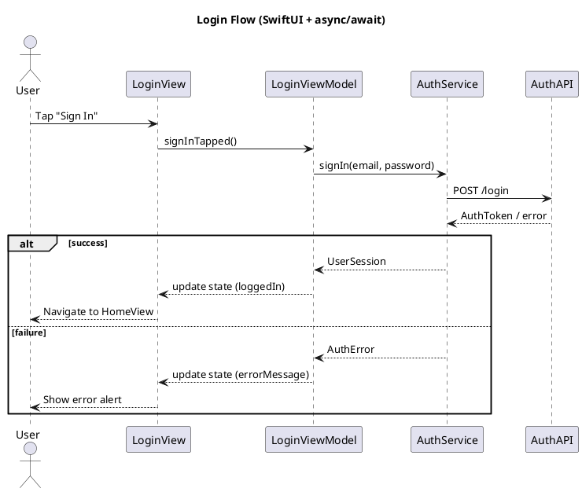
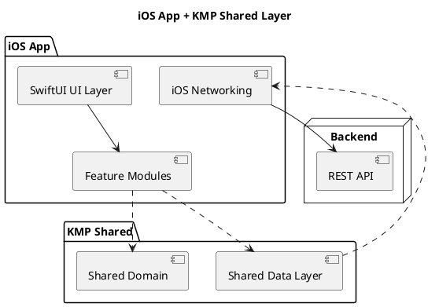

# PlantUML Swift / SwiftUI Skill

## Purpose

This skill converts **Swift and SwiftUI designs** into clear PlantUML diagrams. It’s optimized for:

- Swift types: `struct`, `class`, `enum`, `protocol`, `actor`
- SwiftUI: view hierarchies, navigation flows, container vs leaf views
- iOS app architecture: feature modules, view models, services, coordinators / navigation stacks

The output is always **pure PlantUML** between `@startuml` and `@enduml`, ready for `.puml` files or any PlantUML renderer. [web:167][web:169][web:179]

---

## How to prompt this skill (Swift‑centric)

When asking for a diagram, provide:

1. **Diagram type (from Swift context)**  
   - “Swift class diagram for my feature module”  
   - “Sequence diagram for this async SwiftUI flow”  
   - “Component diagram for my iOS app layers”  

2. **Swift entities and roles**  
   - Key types: `CartView`, `CartViewModel`, `CartService`, `CartActor`, `CartRepository`  
   - Relationships: “View uses ViewModel”, “ViewModel calls Service”, “Service uses Repository”  
   - Ownership: “Feature uses local state vs shared @EnvironmentObject”, etc.

3. **Level of detail**  
   - “High‑level: classes only, no properties”  
   - “Include important properties and key methods only”  
   - “Show async entry points (suspending functions, Task usage)”

4. **SwiftUI specifics (if relevant)**  
   - “Show navigation from `NavigationStack` and `NavigationLink`”  
   - “Highlight which views consume `@EnvironmentObject` vs `@StateObject`”  
   - “Group views into feature modules e.g. `Home`, `Onboarding`, `Settings`”

Example prompts:

- “Generate a class diagram for the Cart feature in SwiftUI: `CartView`, `CartRowView`, `CartViewModel`, `CartActor`, `CartRepository`. Show who depends on whom.”  
- “Create a sequence diagram for the login flow: `LoginView` calls `LoginViewModel`, which calls `AuthService`, which calls `AuthAPI` and updates the view on success.”

---

## Output rules

The skill **must** output:

- A single PlantUML diagram per response, enclosed in:

  ```plantuml
  @startuml
  ...
  @enduml
  ```

- No Markdown fences around the PlantUML unless explicitly requested by the caller.  
- No prose inside the PlantUML block (use `'` comments if needed). [web:167][web:171]

If explanations are required, they must be **outside** the PlantUML block.

---

## Swift naming and modeling conventions

Use Swift‑friendly naming and concepts:

- **Types**
  - `class` → reference type (e.g. `LoginViewModel`, `APIClient`)
  - `struct` → value type (e.g. `User`, `Order`, `CartItem`)
  - `enum` → finite states or cases (e.g. `AuthState`, `OrderStatus`)
  - `protocol` → abstractions (e.g. `AuthServiceProtocol`)
  - `actor` → concurrency‑isolated type (e.g. `CartActor`, `SyncActor`) [web:170][web:173]

- **Visibility**
  - Use `+` for public API and important methods/props.
  - Omit most private details unless they are important for understanding.

- **Dependencies** (Swift‑style)
  - “has a reference to” → association (`--`)
  - “holds lifetime of” → composition (`*--`)
  - “implements protocol” → realization (`<|..`)
  - “inherits class” → inheritance (`<|--`)
  - “uses to perform work” → dependency (`..>`)

Example mapping:

- View depends on ViewModel → `ContentView ..> ContentViewModel`  
- ViewModel uses Service → `ContentViewModel ..> UserService`  
- Concrete service implements protocol → `UserServiceProtocol <|.. DefaultUserService`

---

## Class diagrams for Swift & SwiftUI

### Use case: feature module overview

Represent Swift types with PlantUML `class`, `interface` (for `protocol`), and `enum`. Focus on relationships, not full signatures. [web:170][web:173]

Example (SwiftUI feature):

```plantuml
@startuml
title Cart Feature (SwiftUI)

class CartView {
  +body: some View
}

class CartRowView {
  +body: some View
}

class CartViewModel {
  +items: [CartItem]
  +totalPrice: Decimal
  +loadCart(): Void
  +checkout(): Void
}

class CartItem {
  +id: UUID
  +title: String
  +quantity: Int
  +price: Decimal
}

interface CartRepository {
  +loadItems(): [CartItem]
  +saveItems(items: [CartItem]): Void
}

actor CartActor {
  +loadItems(): [CartItem]
  +saveItems(items: [CartItem]): Void
}

CartView "1" o-- "many" CartRowView
CartView ..> CartViewModel
CartViewModel *-- CartItem
CartViewModel ..> CartRepository
CartRepository <|.. LocalCartRepository
CartRepository <|.. RemoteCartRepository
CartViewModel ..> CartActor

class LocalCartRepository
class RemoteCartRepository

@enduml
```

Patterns to follow:

- Swift `protocol` → `interface` in PlantUML, with implementations via `<|..`.  
- SwiftUI views (`struct SomeView: View`) → normal `class` or `class`‑style representation labeled as views.  
- Keep only fields/methods that represent **public or important feature behavior**.

---

## SwiftUI‑specific modeling patterns

### View → ViewModel → Service layering

The common SwiftUI architecture (`View` → `ViewModel` → `Service`) should be explicit in diagrams.

Suggested conventions:

- View types: suffix `View`
- View models: suffix `ViewModel`
- Service / repository: suffix `Service`, `Repository`, `Client`  
- Actors: suffix `Actor`

Relationships:

- View → ViewModel: dependency (`..>`) or composition (`o--`) if the view owns the view model (`@StateObject`).  
- ViewModel → Service: dependency (`..>`).  
- Service → API / persistence: dependency (`..>` or `*--`).

Example snippet:



### @StateObject / @ObservedObject / @EnvironmentObject

When useful, annotate relationships using notes or labels:

- `@StateObject` → view **owns** view model (composition).
- `@ObservedObject` → view **observes** external view model (association).
- `@EnvironmentObject` → view **consumes shared** view model from environment.

Example:



---

## Sequence diagrams for Swift flows

Sequence diagrams are ideal for modeling:

- Async flows (`Task`, `async/await`, `actor` calls)
- User interactions (button tap → navigation → network → state update)
- Background tasks and callbacks

### Generic SwiftUI async flow

Example (button tap leads to async call via view model to service): [web:174][web:178]



Use these patterns:

- Represent SwiftUI views as `participant` with friendly names and optional aliases.  
- Group asynchronous operations logically; you don’t need to show `Task {}` explicitly unless it’s central to the design.  
- Use `alt` for success / failure, `opt` for optional steps, `loop` for repeated polls or retries.

---

## Component / module diagrams for iOS architecture

Use component diagrams to show **module boundaries** in a Swift project:

- Feature modules (`HomeFeature`, `PaymentsFeature`)
- Shared modules (`DesignSystem`, `Networking`, `Analytics`)
- Platform boundaries (iOS app, KMP shared layer, API backend, etc.)

Example (SwiftUI app + KMP shared layer):



This is useful when you want Claude to reflect module architecture aligned with your Swift package structure or KMP integration.

---

## Style and layout (Swift focus)

Default:

- Let PlantUML auto‑layout.  
- Prefer meaningful type names over technical details.  
- Only add `skinparam` when requested (e.g. “use light purple for view models”). [web:167][web:176]

When styling is requested, keep it minimal:

```plantuml
skinparam classAttributeIconSize 0
skinparam classBackgroundColor #F6F6FF
skinparam classBorderColor #333366
skinparam defaultFontName "SF Pro Text"
```

---

## Reasoning guidelines (Swift‑aware)

When transforming Swift/SwiftUI prompts into PlantUML:

1. **Identify Swift roles**  
   - Distinguish views, view models, services, repositories, actors, models, protocols.
2. **Choose the best diagram type**  
   - Structure (types & relationships) → class diagram.  
   - Behavior (flows over time) → sequence diagram.  
   - Modules & deployment → component diagram.
3. **Map Swift constructs to UML**  
   - `protocol` → `interface` with realization.  
   - `actor` → `class` with concurrency‑oriented responsibilities.  
   - `@StateObject` vs `@EnvironmentObject` as ownership vs shared consumption.
4. **Trim noise**  
   - Focus on semantics (e.g. `loadCart()`, `checkout()`) rather than all methods.  
   - Exclude standard library and trivial helpers.
5. **Ensure valid PlantUML syntax**  
   - One `@startuml` / `@enduml`.  
   - Use valid arrows and relationship keywords. [web:167][web:174]

---

## When to ask follow‑up questions

Ask a brief clarifying question if:

- The user gives a large Swift module without specifying which part to diagram.  
- It’s unclear whether they want **structure** (types) or **behavior** (flow).  
- They mix UI and backend concerns without scope (“diagram entire app and backend”).

Examples:

- “Do you want a class diagram of the Swift types or a sequence diagram of the user flow?”  
- “Which feature should the diagram focus on: onboarding, checkout, or account management?”

This keeps diagrams focused, readable, and directly useful for Swift/SwiftUI design work.
